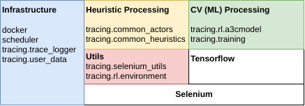
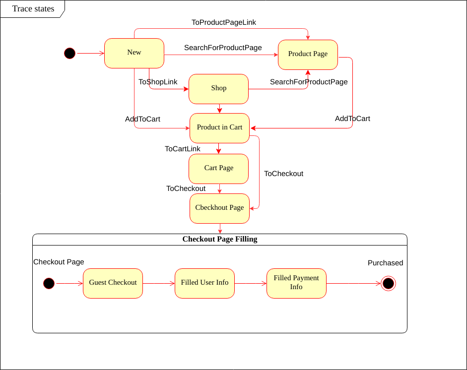

## Overview

The goal of the Shop Tracer is to purchase any arbitrary product from a given site if it's possible and save the resulting trace.
The system should be able to run Shop Tracer for every site from a given list of domains.

Shop Tracer do the following steps:
1. Obtains user information from retrace Web Service
2. Navigates to checkout page
  adding to cart and closing popups during it
3. Fills Checkout page using user information
4. Makes a payment and checks response


Some parts of the solution are ML-based (and currently being built):
- Checking if the page is a popup or a checkout page
- Strategy to close popup
- Strategy to navigate to Checkout Page


During tracing all traces are stored by TraceLogger. It could be FileTraceLogger and MongoDbTraceLogger.

## Physical Architecture
System is based on Docker-Compose.
1. In every host there should be:
    - User Data Service (from retrace_automation repo)
    - Shop Tracer Worker each starts several independent processing threads (usually 4 or 8)

2. MongoDB and RabbitMQ must be started and be accessible from hosts 

3. Scheduler must be started and have an access to RabbitMQ


## Logical Architecture
Brief components overview is pictured in the following diagram:



The system is written with Python3.
The main technologies:
1. Python3, Pip
2. Selenium + Chromium + Xvfb
3. Tensorflow
4. MongoDB
5. RabbitMQ
6. Docker

## Deploy and Run in Production
1. Clone both two github repositories in the same folder:
    ```shell
    git clone https://github.com/g2webservices/retrace_automation
    git clone https://github.com/g2webservices/trace_automation
    ```
2. Start RabbitMQ
3. Start MongoDB
4. Set MongoDB and RabbitMQ hosts to trace_automation/config.ini
5. Run Docker
    ```shell
    cd trace_automation/docker
    sudo docker-compose up
    ```

## Deploy and Run in Local Mode

This method is different from production deploy. And this method is easier test and run manually.
First we need to start data service with mock user data

1. Clone retrace_automation repo
    ```shell
    git clone https://github.com/g2webservices/retrace_automation
    ```
    
2. Install dependencies.
    Be careful service uses python2
    ```shell
    pip2 install falcon ujson faker barnum gunicorn
    ```

3. Run Service in a background in port 8989
    ```shell
    (cd retrace_automation/backend; gunicorn -b 127.0.0.1:8989 r_service:api) &> mock_service.log &
    ```

Then we can run shop tracing.

1. Clone trace_automation repo
    ```shell
    git clone https://github.com/g2webservices/trace_automation
    ```

    We can start code that runs tracing on random sample shops code shop_crawler_stat_test.py

2. Install tracing package (using file setup.py in the root)
    ```shell
    pip install -I trace_automation
    ```

3. Use xvfb to run in headless mode:
    ```shell
    sudo apt-get install xvfb
    cd trace_automation/tracing
    xvfb-run -s "-screen 0 1280x960x16" python trace_automation/tests/shop_tracer_stat_test.py
    ```

4. Or it's possible to run jupyter-notebook 
    ```shell
    jupyter-notebook trace_automation/analytics/shop_tracer.ipynb
    ```

### Heuristic processing
Heuristic processing is based on FSM (Final State Machine).
Here is a rough schema of heuristic states (real is a bit harder):


See handlers are defined in tracing.common_actors.py

### ML processing

1. Collect dataset for popups classification:
    ```shell
    cd trace_automation/tracing/training/popups
    python create_dataset.py
    ```
    Dataset could be analyzed and labeled by jupyter-notebook
    
    ```shell
    jupyter-notebook analyze_dataset.ipynb
    ```
    
    Dataset could be downloaded from S3.
    Below an example how to work with it.
    ```python
    from tracing.utils.downloader import Downloader
    from tracing.training.popups.create_dataset import PopupsDataset

    
    popups_dataset_file = Downloader().download_checkout_dataset()
    popups_dataset = PopupsDataset.read(popups_dataset_file).items
    popups_dataset = list([url for url in popups_dataset if url['to_classify'] == True])
    ```

2. Create dataset for checkout classification:
    Run fast tracing and collect traces for 10,000 urls
    ```shell
    cd trace_automation/tracing/training/navigation
    python collect_traces.py
    ```
    
    Check additionally that checkout pages are really checkout pages
    ```shell
    jupyter-notebook analyze_checkout_page_dataset.ipynb
    ```
     
    Run classification dataset construction
    ```shell
    python create_classification_dataset.py
    ```
    
    Dataset could be downloaded from S3.
    Below an example how to work with it.
    ```python
    from tracing.utils.downloader import Downloader
    from tracing.training.navigation.create_classification_dataset import CheckoutsDataset
    
    checkouts_dataset_file = Downloader().download_checkout_dataset()

    checkouts_dataset = CheckoutsDataset.read(checkouts_dataset_file).items
    ```

3. Classification Model Training
   Classification model trained using CNN (Convolutional Neural Networks).
   So we suggest to use GPU. 
   In AWS it could p2.xlarge. Using TRA-GPU AMI will make it easier.
   
   (If you use AMI than consider replace python -> python3)  
   ```shell
   cd trace_autonation/tracing/training/classification
   python train_page_classification.py
   ```
   
   Pretrained model could be downloaded from S3.
   ```python
   import tensorflow as tf
   from tracing.training.classification.page_classifier import PageClassifier
   from tracing.utils.downloader import Downloader

   model_file = Downloader().download_classification_model()   
   g1 = tf.Graph()
   with g1.as_default():
       page_classifier = PageClassifier.get_pretrained(model_file)
   
   ``` 

4. Pretraining
   Right now pretraining is done only for Popups.
   Will create the same for navigation and Checkout Page filling.
   
   Dataset construction
   ```shell
   cd trace_automation/tracing/training/pretrain
   python controls_extractor.py
   ```
   
   Run model pretraining
   ```shell
   python controls_pretrain.py
   ```

5. Reinforcement Learning for Popups
   It takes a lot of CPU (because of selenium).
   So we suggest to use AWS instance c4.2xlarge.
   Using our AMI TRA-RL could make it easier.     
   ```shell
   cd trace_automation/tracing/training/popups
   python train_popups.py
   ```
   
   ToDo simplify code, train and upload to S3

6. Dataset for initial policy for Navigation
    
    ```shell
    cd trace_automation/tracing/training/navigation
    python create_policy_dataset.py 
    ```
    
    ToDo upload dataset to S3
    
